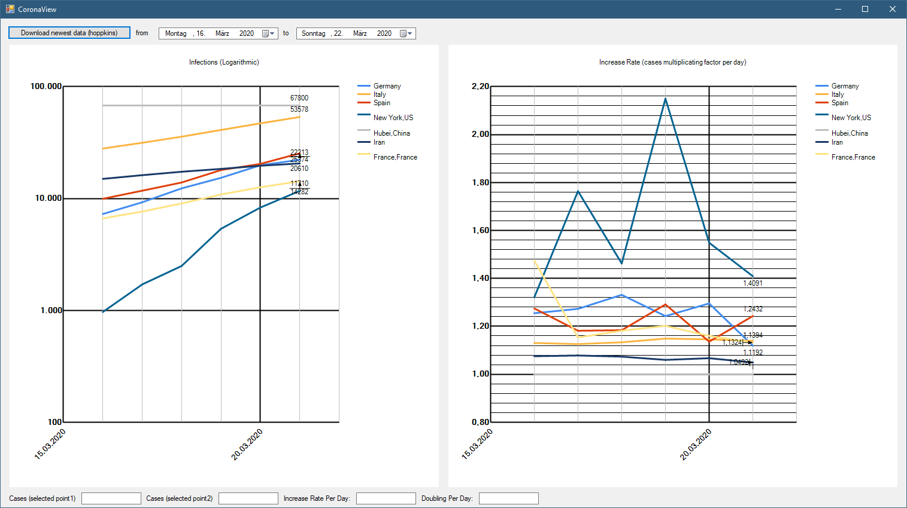

Build status (AppVeyor / GitHub Action)

# CoronaViewer

This viewer shows the infection numbers and the increasing/spread-factor(!). It uses the John Hopkins data. It should help to understand politician decisions to isolate.

## Downloads
see Artifacts at [https://github.com/SIRprise/CoronaViewer/actions]
